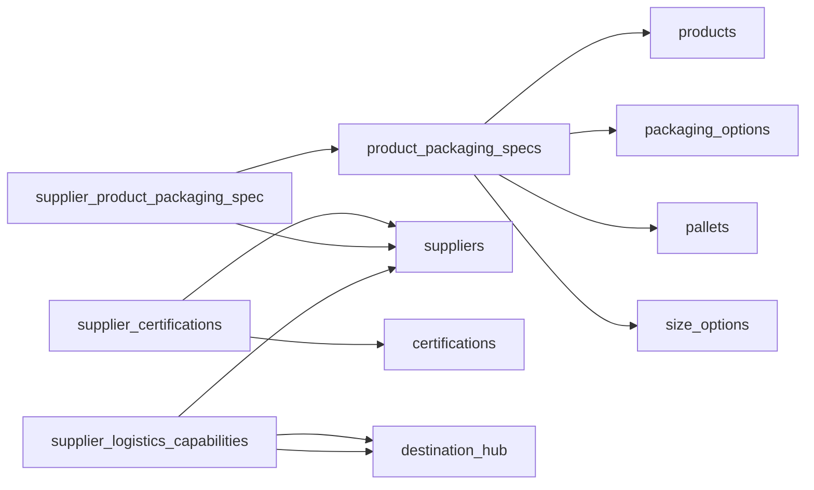

# Complete Database Schema Documentation

> Last updated: 2025-09-12
> Generated from Supabase production database

## Table of Contents
1. [Enums](#enums)
2. [Tables](#tables)
3. [Relationships](#relationships)
4. [Indexes](#indexes)
5. [Permissions](#permissions)

---

## Enums

### `day_of_week_enum`
Days of the week for scheduling
```sql
CREATE TYPE "public"."day_of_week_enum" AS ENUM (
    'monday',
    'tuesday',
    'wednesday',
    'thursday',
    'friday',
    'saturday',
    'sunday'
);
```

### `delivery_mode_enum`
Delivery and shipping modes
```sql
CREATE TYPE "public"."delivery_mode_enum" AS ENUM (
    'Ex Works',
    'DELIVERY',
    'TRANSIT'
);
```

### `month_enum`
Calendar months
```sql
CREATE TYPE "public"."month_enum" AS ENUM (
    'january',
    'february',
    'march',
    'april',
    'may',
    'june',
    'july',
    'august',
    'september',
    'october',
    'november',
    'december'
);
```

### `product_category`
Product categories
```sql
CREATE TYPE "public"."product_category" AS ENUM (
    'tomatoes',
    'lettuce',
    'babyleaf',
    'citrus',
    'greenhouse_crop',
    'mushroom',
    'grapes',
    'carrots',
    'potatoes',
    'onions',
    'fruit',
    'vegetables'
);
```

### `product_intended_use_enum`
Product intended use types
```sql
CREATE TYPE "public"."product_intended_use_enum" AS ENUM (
    'Wholesale',
    'Retail',
    'Industry',
    'Process'
);
```

### `season_enum`
Seasonal periods
```sql
CREATE TYPE "public"."season_enum" AS ENUM (
    'spring',
    'summer',
    'autumn',
    'winter',
    'year_round'
);
```

### `sold_by_enum`
Unit of sale types
```sql
CREATE TYPE "public"."sold_by_enum" AS ENUM (
    'kg',
    'piece',
    'box',
    'punnet',
    'bag'
);
```

### `unit_type_enum`
Packaging unit types
```sql
CREATE TYPE "public"."unit_type_enum" AS ENUM (
    'box',
    'bag',
    'container',
    'crate',
    'tray',
    'bulk'
);
```

### `weight_unit`
Weight measurement units
```sql
CREATE TYPE "public"."weight_unit" AS ENUM (
    'kg',
    'g',
    'ton'
);
```

---

## Tables

### 📦 Product Catalog Tables

#### `products`
Main product catalog
```sql
CREATE TABLE "public"."products" (
    "id" UUID PRIMARY KEY DEFAULT uuid_generate_v4(),
    "name" TEXT NOT NULL,
    "category" product_category NOT NULL,
    "intended_use" product_intended_use_enum NOT NULL,
    "sold_by" sold_by_enum NOT NULL,
    "is_active" BOOLEAN DEFAULT true NOT NULL,
    "created_at" TIMESTAMPTZ DEFAULT now() NOT NULL
);
```

#### `packaging_options`
Different packaging types with optional fees
```sql
CREATE TABLE "public"."packaging_options" (
    "id" UUID PRIMARY KEY DEFAULT uuid_generate_v4(),
    "label" TEXT NOT NULL UNIQUE,
    "unit_type" unit_type_enum NOT NULL,
    "description" TEXT,
    "deposit_fee" NUMERIC CHECK (deposit_fee >= 0),
    "rent_fee" NUMERIC CHECK (rent_fee >= 0),
    "created_at" TIMESTAMPTZ DEFAULT now() NOT NULL
);
```

#### `pallets`
Pallet specifications with optional deposit fees
```sql
CREATE TABLE "public"."pallets" (
    "id" UUID PRIMARY KEY DEFAULT uuid_generate_v4(),
    "label" TEXT NOT NULL UNIQUE,
    "dimensions_cm" TEXT,  -- e.g., "120x80x15"
    "brutto_weight" NUMERIC CHECK (brutto_weight > 0),
    "pallets_per_truck" NUMERIC CHECK (pallets_per_truck > 0),
    "deposit_fee" NUMERIC CHECK (deposit_fee >= 0),
    "created_at" TIMESTAMPTZ DEFAULT now() NOT NULL
);
```

#### `size_options`
Available size options (S, M, L, etc.)
```sql
CREATE TABLE "public"."size_options" (
    "id" UUID PRIMARY KEY DEFAULT uuid_generate_v4(),
    "name" TEXT NOT NULL UNIQUE,
    "created_at" TIMESTAMPTZ DEFAULT now() NOT NULL
);
```

#### `product_packaging_specs`
Product specifications combining product, packaging, pallet, and size
```sql
CREATE TABLE "public"."product_packaging_specs" (
    "id" UUID PRIMARY KEY DEFAULT uuid_generate_v4(),
    "product_id" UUID NOT NULL REFERENCES products(id) ON DELETE CASCADE,
    "packaging_id" UUID NOT NULL REFERENCES packaging_options(id) ON DELETE CASCADE,
    "pallet_id" UUID NOT NULL REFERENCES pallets(id) ON DELETE CASCADE,
    "size_option_id" UUID NOT NULL REFERENCES size_options(id) ON DELETE CASCADE,
    "boxes_per_pallet" INTEGER NOT NULL CHECK (boxes_per_pallet > 0),
    "weight_per_box" NUMERIC CHECK (weight_per_box > 0),
    "weight_per_pallet" NUMERIC CHECK (weight_per_pallet > 0),
    "weight_unit" weight_unit NOT NULL,
    "pieces_per_box" INTEGER CHECK (pieces_per_box > 0),
    "created_at" TIMESTAMPTZ DEFAULT now() NOT NULL
);
```

### 🚚 Supplier Hub Tables

#### `suppliers`
Supplier information and contact details
```sql
CREATE TABLE "public"."suppliers" (
    "id" UUID PRIMARY KEY DEFAULT uuid_generate_v4(),
    "name" TEXT NOT NULL,
    "email" TEXT UNIQUE,
    "phone_number" TEXT,
    "address" TEXT,
    "warehouse_address" TEXT,
    "city" TEXT,
    "zip_code" TEXT,
    "country" TEXT,
    "delivery_modes" delivery_mode_enum[] DEFAULT '{}',
    "is_active" BOOLEAN DEFAULT true NOT NULL,
    "notes" TEXT,
    "created_at" TIMESTAMPTZ DEFAULT now() NOT NULL
);
```

#### `certifications`
Available certifications that suppliers can hold
```sql
CREATE TABLE "public"."certifications" (
    "id" UUID PRIMARY KEY DEFAULT uuid_generate_v4(),
    "name" TEXT NOT NULL UNIQUE,
    "description" TEXT,
    "created_at" TIMESTAMPTZ DEFAULT now() NOT NULL
);
```

#### `hubs`
Logistics hubs for routing and distribution
```sql
CREATE TABLE "public"."hubs" (
    "id" UUID PRIMARY KEY DEFAULT uuid_generate_v4(),
    "name" TEXT NOT NULL,
    "hub_code" TEXT NOT NULL UNIQUE,
    "country_code" TEXT,
    "city_name" TEXT,
    "region" TEXT,
    "is_active" BOOLEAN DEFAULT true NOT NULL,
    "created_at" TIMESTAMPTZ DEFAULT now() NOT NULL
);
```

#### `supplier_certifications`
Certifications held by suppliers with validity dates
```sql
CREATE TABLE "public"."supplier_certifications" (
    "id" UUID PRIMARY KEY DEFAULT uuid_generate_v4(),
    "supplier_id" UUID NOT NULL REFERENCES suppliers(id) ON DELETE CASCADE,
    "certification_id" UUID NOT NULL REFERENCES certifications(id) ON DELETE CASCADE,
    "issued_at" DATE,
    "expires_at" DATE CHECK (expires_at > issued_at),
    "created_at" TIMESTAMPTZ DEFAULT now() NOT NULL,
    UNIQUE(supplier_id, certification_id)
);
```

#### `supplier_product_packaging_spec`
Products offered by suppliers with seasonality information
```sql
CREATE TABLE "public"."supplier_product_packaging_spec" (
    "id" UUID PRIMARY KEY DEFAULT uuid_generate_v4(),
    "supplier_id" UUID NOT NULL REFERENCES suppliers(id) ON DELETE CASCADE,
    "product_packaging_spec_id" UUID NOT NULL REFERENCES product_packaging_specs(id),
    "notes" TEXT,
    "season" season_enum,
    "available_months" month_enum[],
    "available_from_date" DATE,
    "available_till_date" DATE CHECK (available_till_date >= available_from_date),
    "recurring_start_month" month_enum,
    "recurring_start_day" INTEGER CHECK (recurring_start_day BETWEEN 1 AND 31),
    "recurring_end_month" month_enum,
    "recurring_end_day" INTEGER CHECK (recurring_end_day BETWEEN 1 AND 31),
    "created_at" TIMESTAMPTZ DEFAULT now() NOT NULL,
    UNIQUE(supplier_id, product_packaging_spec_id)
);
```

#### `supplier_logistics_capabilities`
Supplier delivery capabilities between hubs
```sql
CREATE TABLE "public"."supplier_logistics_capabilities" (
    "id" UUID PRIMARY KEY DEFAULT uuid_generate_v4(),
    "supplier_id" UUID NOT NULL REFERENCES suppliers(id) ON DELETE CASCADE,
    "mode" delivery_mode_enum NOT NULL,
    "origin_hub_id" UUID NOT NULL REFERENCES hubs(id),
    "destination_hub_id" UUID REFERENCES hubs(id),
    "typical_lead_time_days" INTEGER CHECK (typical_lead_time_days > 0),
    "fixed_operational_days" day_of_week_enum[],
    "notes" TEXT,
    "created_at" TIMESTAMPTZ DEFAULT now() NOT NULL,
    CHECK (destination_hub_id IS NULL OR origin_hub_id != destination_hub_id)
);
```

**Note**: `destination_hub_id` is nullable to support "Ex Works" delivery mode where buyer picks up at origin location.

---

## Relationships

### Foreign Key Relationships



---

## Indexes

### Product Catalog Indexes
- `idx_products_category` - on products(category)
- `idx_products_intended_use` - on products(intended_use)
- `idx_products_is_active` - on products(is_active)
- `idx_packaging_options_unit_type` - on packaging_options(unit_type)
- `idx_product_packaging_specs_product_id` - on product_packaging_specs(product_id)
- `idx_product_packaging_specs_packaging_id` - on product_packaging_specs(packaging_id)
- `idx_product_packaging_specs_pallet_id` - on product_packaging_specs(pallet_id)
- `idx_product_packaging_specs_size_option_id` - on product_packaging_specs(size_option_id)

### Supplier Hub Indexes
- `idx_suppliers_is_active` - on suppliers(is_active)
- `idx_suppliers_country` - on suppliers(country)
- `idx_suppliers_city` - on suppliers(city)
- `idx_hubs_country_code` - on hubs(country_code)
- `idx_hubs_is_active` - on hubs(is_active)
- `idx_supplier_certifications_supplier_id` - on supplier_certifications(supplier_id)
- `idx_supplier_certifications_certification_id` - on supplier_certifications(certification_id)
- `idx_supplier_certifications_expires_at` - on supplier_certifications(expires_at)
- `idx_supplier_product_packaging_spec_supplier_id` - on supplier_product_packaging_spec(supplier_id)
- `idx_supplier_product_packaging_spec_product_id` - on supplier_product_packaging_spec(product_packaging_spec_id)
- `idx_supplier_product_packaging_spec_season` - on supplier_product_packaging_spec(season)
- `idx_supplier_logistics_capabilities_supplier_id` - on supplier_logistics_capabilities(supplier_id)
- `idx_supplier_logistics_capabilities_origin_hub` - on supplier_logistics_capabilities(origin_hub_id)
- `idx_supplier_logistics_capabilities_destination_hub` - on supplier_logistics_capabilities(destination_hub_id)
- `idx_supplier_logistics_capabilities_mode` - on supplier_logistics_capabilities(mode)

---

## Permissions

### Current Permission Setup
All tables have been configured with the following permissions:

```sql
-- All tables have RLS DISABLED for development
-- All tables grant full access to:
GRANT ALL ON TABLE [table_name] TO "anon";
GRANT ALL ON TABLE [table_name] TO "authenticated";
GRANT ALL ON TABLE [table_name] TO "service_role";
```

### Tables with Full Anonymous Access
- ✅ products
- ✅ packaging_options
- ✅ pallets
- ✅ size_options
- ✅ product_packaging_specs
- ✅ suppliers
- ✅ certifications
- ✅ hubs
- ✅ supplier_certifications
- ✅ supplier_product_packaging_spec
- ✅ supplier_logistics_capabilities

---

## Quick Reference

### Common Queries

#### Get all products with their specs
```sql
SELECT 
    p.name as product_name,
    p.category,
    po.label as packaging,
    pl.label as pallet_type,
    so.name as size,
    pps.boxes_per_pallet,
    pps.weight_per_box,
    pps.weight_unit
FROM product_packaging_specs pps
JOIN products p ON pps.product_id = p.id
JOIN packaging_options po ON pps.packaging_id = po.id
JOIN pallets pl ON pps.pallet_id = pl.id
JOIN size_options so ON pps.size_option_id = so.id
WHERE p.is_active = true;
```

#### Get supplier products with availability
```sql
SELECT 
    s.name as supplier_name,
    p.name as product_name,
    spps.season,
    spps.available_months,
    spps.notes
FROM supplier_product_packaging_spec spps
JOIN suppliers s ON spps.supplier_id = s.id
JOIN product_packaging_specs pps ON spps.product_packaging_spec_id = pps.id
JOIN products p ON pps.product_id = p.id
WHERE s.is_active = true;
```

#### Get supplier certifications
```sql
SELECT 
    s.name as supplier_name,
    c.name as certification,
    sc.issued_at,
    sc.expires_at
FROM supplier_certifications sc
JOIN suppliers s ON sc.supplier_id = s.id
JOIN certifications c ON sc.certification_id = c.id
WHERE sc.expires_at > CURRENT_DATE OR sc.expires_at IS NULL;
```

---

## Notes

- All UUID fields use `uuid_generate_v4()` for automatic generation
- All tables include `created_at` timestamp with timezone
- Soft delete pattern using `is_active` flags on key entities
- Array types used for flexible multi-value fields (delivery_modes, available_months, etc.)
- Comprehensive check constraints ensure data integrity
- Foreign key cascades on DELETE for dependent records