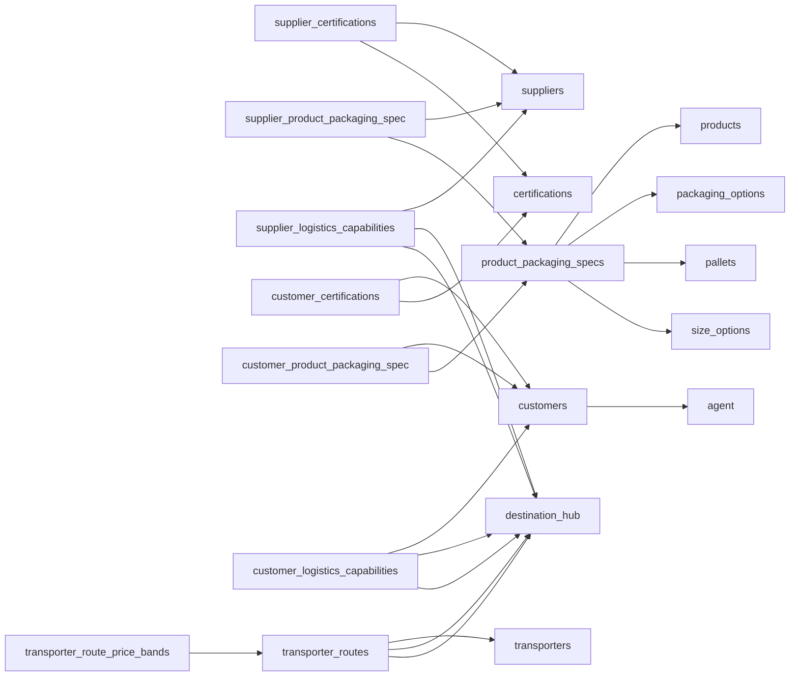

# Complete Database Schema Documentation

> Last updated: 2025-09-16
> Generated from Supabase production database

## Table of Contents
1. [Enums](#enums)
2. [Tables](#tables)
3. [Relationships](#relationships)
4. [Indexes](#indexes)
5. [Permissions](#permissions)

---

## Enums

### `day_of_week_enum`
Days of the week for scheduling
```sql
CREATE TYPE "public"."day_of_week_enum" AS ENUM (
    'monday',
    'tuesday',
    'wednesday',
    'thursday',
    'friday',
    'saturday',
    'sunday'
);
```

### `delivery_mode_enum`
Delivery and shipping modes
```sql
CREATE TYPE "public"."delivery_mode_enum" AS ENUM (
    'Ex Works',
    'DELIVERY',
    'TRANSIT'
);
```

### `month_enum`
Calendar months
```sql
CREATE TYPE "public"."month_enum" AS ENUM (
    'january',
    'february',
    'march',
    'april',
    'may',
    'june',
    'july',
    'august',
    'september',
    'october',
    'november',
    'december'
);
```

### `product_category`
Product categories
```sql
CREATE TYPE "public"."product_category" AS ENUM (
    'tomatoes',
    'lettuce',
    'babyleaf',
    'citrus',
    'greenhouse_crop',
    'mushroom',
    'grapes',
    'carrots',
    'potatoes',
    'onions',
    'fruit',
    'vegetables'
);
```

### `product_intended_use_enum`
Product intended use types
```sql
CREATE TYPE "public"."product_intended_use_enum" AS ENUM (
    'Wholesale',
    'Retail',
    'Industry',
    'Process'
);
```

### `season_enum`
Seasonal periods
```sql
CREATE TYPE "public"."season_enum" AS ENUM (
    'spring',
    'summer',
    'autumn',
    'winter',
    'year_round'
);
```

### `sold_by_enum`
Unit of sale types
```sql
CREATE TYPE "public"."sold_by_enum" AS ENUM (
    'kg',
    'piece',
    'box',
    'punnet',
    'bag'
);
```

### `unit_type_enum`
Packaging unit types
```sql
CREATE TYPE "public"."unit_type_enum" AS ENUM (
    'box',
    'bag',
    'container',
    'crate',
    'tray',
    'bulk'
);
```

### `weight_unit`
Weight measurement units
```sql
CREATE TYPE "public"."weight_unit" AS ENUM (
    'kg',
    'g',
    'ton'
);
```

---

## Tables

### 📦 Product Catalog Tables

#### `products`
Main product catalog
```sql
CREATE TABLE "public"."products" (
    "id" UUID PRIMARY KEY DEFAULT uuid_generate_v4(),
    "name" TEXT NOT NULL,
    "category" product_category NOT NULL,
    "intended_use" product_intended_use_enum NOT NULL,
    "sold_by" sold_by_enum NOT NULL,
    "is_active" BOOLEAN DEFAULT true NOT NULL,
    "created_at" TIMESTAMPTZ DEFAULT now() NOT NULL
);
```

#### `packaging_options`
Different packaging types with optional fees
```sql
CREATE TABLE "public"."packaging_options" (
    "id" UUID PRIMARY KEY DEFAULT uuid_generate_v4(),
    "label" TEXT NOT NULL UNIQUE,
    "unit_type" unit_type_enum NOT NULL,
    "description" TEXT,
    "deposit_fee" NUMERIC CHECK (deposit_fee >= 0),
    "rent_fee" NUMERIC CHECK (rent_fee >= 0),
    "created_at" TIMESTAMPTZ DEFAULT now() NOT NULL
);
```

#### `pallets`
Pallet specifications with optional deposit fees
```sql
CREATE TABLE "public"."pallets" (
    "id" UUID PRIMARY KEY DEFAULT uuid_generate_v4(),
    "label" TEXT NOT NULL UNIQUE,
    "dimensions_cm" TEXT,  -- e.g., "120x80x15"
    "brutto_weight" NUMERIC CHECK (brutto_weight > 0),
    "pallets_per_truck" NUMERIC CHECK (pallets_per_truck > 0),
    "deposit_fee" NUMERIC CHECK (deposit_fee >= 0),
    "created_at" TIMESTAMPTZ DEFAULT now() NOT NULL
);
```

#### `size_options`
Available size options (S, M, L, etc.)
```sql
CREATE TABLE "public"."size_options" (
    "id" UUID PRIMARY KEY DEFAULT uuid_generate_v4(),
    "name" TEXT NOT NULL UNIQUE,
    "created_at" TIMESTAMPTZ DEFAULT now() NOT NULL
);
```

#### `product_packaging_specs`
Product specifications combining product, packaging, pallet, and size
```sql
CREATE TABLE "public"."product_packaging_specs" (
    "id" UUID PRIMARY KEY DEFAULT uuid_generate_v4(),
    "product_id" UUID NOT NULL REFERENCES products(id) ON DELETE CASCADE,
    "packaging_id" UUID NOT NULL REFERENCES packaging_options(id) ON DELETE CASCADE,
    "pallet_id" UUID NOT NULL REFERENCES pallets(id) ON DELETE CASCADE,
    "size_option_id" UUID NOT NULL REFERENCES size_options(id) ON DELETE CASCADE,
    "boxes_per_pallet" INTEGER NOT NULL CHECK (boxes_per_pallet > 0),
    "weight_per_box" NUMERIC CHECK (weight_per_box > 0),
    "weight_per_pallet" NUMERIC CHECK (weight_per_pallet > 0),
    "weight_unit" weight_unit NOT NULL,
    "pieces_per_box" INTEGER CHECK (pieces_per_box > 0),
    "created_at" TIMESTAMPTZ DEFAULT now() NOT NULL
);
```

### 🚚 Supplier Hub Tables

#### `suppliers`
Supplier information and contact details
```sql
CREATE TABLE "public"."suppliers" (
    "id" UUID PRIMARY KEY DEFAULT uuid_generate_v4(),
    "name" TEXT NOT NULL,
    "email" TEXT UNIQUE,
    "phone_number" TEXT,
    "address" TEXT,
    "warehouse_address" TEXT,
    "city" TEXT,
    "zip_code" TEXT,
    "country" TEXT,
    "delivery_modes" delivery_mode_enum[] DEFAULT '{}',
    "agent_id" UUID REFERENCES staff(id) ON DELETE SET NULL,
    "latitude" DECIMAL(10,8),
    "longitude" DECIMAL(11,8),
    "coordinates_last_updated" TIMESTAMPTZ,
    "coordinates_source" TEXT DEFAULT 'nominatim',
    "geocoding_failed" BOOLEAN DEFAULT false,
    "geocoding_attempts" INTEGER DEFAULT 0,
    "is_active" BOOLEAN DEFAULT true NOT NULL,
    "notes" TEXT,
    "created_at" TIMESTAMPTZ DEFAULT now() NOT NULL
);
```

#### `certifications`
Available certifications that suppliers can hold
```sql
CREATE TABLE "public"."certifications" (
    "id" UUID PRIMARY KEY DEFAULT uuid_generate_v4(),
    "name" TEXT NOT NULL UNIQUE,
    "description" TEXT,
    "created_at" TIMESTAMPTZ DEFAULT now() NOT NULL
);
```

#### `hubs`
Logistics hubs for routing and distribution (supports multi-hop transshipment) with automatic geocoding
```sql
CREATE TABLE "public"."hubs" (
    "id" UUID PRIMARY KEY DEFAULT uuid_generate_v4(),
    "name" TEXT NOT NULL,
    "hub_code" TEXT NOT NULL UNIQUE,
    "country_code" TEXT,
    "city_name" TEXT,
    "region" TEXT,
    "is_active" BOOLEAN DEFAULT true NOT NULL,
    "can_transship" BOOLEAN DEFAULT false,
    "transship_handling_time_hours" INTEGER DEFAULT 0,
    "transship_cost_per_pallet" DECIMAL(10,2) DEFAULT 0,
    "latitude" DECIMAL(10,8), -- Latitude coordinate (WGS84) automatically geocoded from city_name and country_code
    "longitude" DECIMAL(11,8), -- Longitude coordinate (WGS84) automatically geocoded from city_name and country_code
    "coordinates_last_updated" TIMESTAMPTZ, -- Timestamp when coordinates were last successfully geocoded
    "coordinates_source" TEXT DEFAULT 'nominatim', -- Source of geocoding (nominatim)
    "geocoding_failed" BOOLEAN DEFAULT false, -- True if geocoding attempts have failed
    "geocoding_attempts" INTEGER DEFAULT 0, -- Number of geocoding attempts made
    "created_at" TIMESTAMPTZ DEFAULT now() NOT NULL
);
```

#### `supplier_certifications`
Certifications held by suppliers with validity dates
```sql
CREATE TABLE "public"."supplier_certifications" (
    "id" UUID PRIMARY KEY DEFAULT uuid_generate_v4(),
    "supplier_id" UUID NOT NULL REFERENCES suppliers(id) ON DELETE CASCADE,
    "certification_id" UUID NOT NULL REFERENCES certifications(id) ON DELETE CASCADE,
    "issued_at" DATE,
    "expires_at" DATE CHECK (expires_at > issued_at),
    "created_at" TIMESTAMPTZ DEFAULT now() NOT NULL,
    UNIQUE(supplier_id, certification_id)
);
```

#### `supplier_product_packaging_spec`
Products offered by suppliers with seasonality information
```sql
CREATE TABLE "public"."supplier_product_packaging_spec" (
    "id" UUID PRIMARY KEY DEFAULT uuid_generate_v4(),
    "supplier_id" UUID NOT NULL REFERENCES suppliers(id) ON DELETE CASCADE,
    "product_packaging_spec_id" UUID NOT NULL REFERENCES product_packaging_specs(id),
    "notes" TEXT,
    "season" season_enum,
    "available_months" month_enum[],
    "available_from_date" DATE,
    "available_till_date" DATE CHECK (available_till_date >= available_from_date),
    "recurring_start_month" month_enum,
    "recurring_start_day" INTEGER CHECK (recurring_start_day BETWEEN 1 AND 31),
    "recurring_end_month" month_enum,
    "recurring_end_day" INTEGER CHECK (recurring_end_day BETWEEN 1 AND 31),
    "created_at" TIMESTAMPTZ DEFAULT now() NOT NULL,
    UNIQUE(supplier_id, product_packaging_spec_id)
);
```

#### `supplier_logistics_capabilities`
Supplier delivery capabilities between hubs
```sql
CREATE TABLE "public"."supplier_logistics_capabilities" (
    "id" UUID PRIMARY KEY DEFAULT uuid_generate_v4(),
    "supplier_id" UUID NOT NULL REFERENCES suppliers(id) ON DELETE CASCADE,
    "mode" delivery_mode_enum NOT NULL,
    "origin_hub_id" UUID NOT NULL REFERENCES hubs(id),
    "destination_hub_id" UUID REFERENCES hubs(id),
    "typical_lead_time_days" INTEGER CHECK (typical_lead_time_days > 0),
    "fixed_operational_days" day_of_week_enum[],
    "notes" TEXT,
    "created_at" TIMESTAMPTZ DEFAULT now() NOT NULL,
    CHECK (destination_hub_id IS NULL OR origin_hub_id != destination_hub_id)
);
```

**Note**: `destination_hub_id` is nullable to support "Ex Works" delivery mode where buyer picks up at origin location.

### 👥 Customer Management Tables

#### `staff`
Internal staff members who handle customer relationships
```sql
CREATE TABLE "public"."staff" (
    "id" UUID PRIMARY KEY DEFAULT uuid_generate_v4(),
    "name" TEXT NOT NULL,
    "email" TEXT UNIQUE,
    "phone_number" TEXT,
    "role" TEXT, -- e.g., "Account Manager", "Sales Representative"
    "department" TEXT, -- e.g., "Sales", "Customer Service"
    "is_active" BOOLEAN DEFAULT true NOT NULL,
    "auth_user_id" UUID REFERENCES auth.users(id) ON DELETE SET NULL UNIQUE, -- Links to Supabase auth user (one-to-one)
    "created_at" TIMESTAMPTZ DEFAULT now() NOT NULL
);
```

**Constraints:**
- `staff_auth_user_id_unique` - UNIQUE constraint on auth_user_id to ensure one-to-one relationship between staff and auth users

#### `customers`
Customer information and contact details with agent assignment and automatic geocoding
```sql
CREATE TABLE "public"."customers" (
    "id" UUID PRIMARY KEY DEFAULT uuid_generate_v4(),
    "name" TEXT NOT NULL,
    "email" TEXT UNIQUE,
    "phone_number" TEXT,
    "address" TEXT,
    "warehouse_address" TEXT,
    "city" TEXT,
    "zip_code" TEXT,
    "country" TEXT,
    "delivery_modes" delivery_mode_enum[] DEFAULT '{}',
    "agent_id" UUID REFERENCES staff(id), -- Responsible internal staff member
    "latitude" DECIMAL(10,8), -- Latitude coordinate (WGS84) automatically geocoded from city and country
    "longitude" DECIMAL(11,8), -- Longitude coordinate (WGS84) automatically geocoded from city and country
    "coordinates_last_updated" TIMESTAMPTZ, -- Timestamp when coordinates were last successfully geocoded
    "coordinates_source" TEXT DEFAULT 'nominatim', -- Source of geocoding (nominatim)
    "geocoding_failed" BOOLEAN DEFAULT false, -- True if geocoding attempts have failed
    "geocoding_attempts" INTEGER DEFAULT 0, -- Number of geocoding attempts made
    "is_active" BOOLEAN DEFAULT true NOT NULL,
    "notes" TEXT,
    "created_at" TIMESTAMPTZ DEFAULT now() NOT NULL
);
```

#### `customer_product_packaging_spec`
Products required by customers with local vs import seasonality
```sql
CREATE TABLE "public"."customer_product_packaging_spec" (
    "id" UUID PRIMARY KEY DEFAULT uuid_generate_v4(),
    "customer_id" UUID NOT NULL REFERENCES customers(id) ON DELETE CASCADE,
    "product_packaging_spec_id" UUID NOT NULL REFERENCES product_packaging_specs(id),
    "notes" TEXT,
    "season" season_enum,
    "available_months" month_enum[],
    "local_production_from_date" DATE,
    "local_production_till_date" DATE CHECK (local_production_till_date >= local_production_from_date),
    "import_period_from_date" DATE,
    "import_period_till_date" DATE CHECK (import_period_till_date >= import_period_from_date),
    "recurring_local_start_month" month_enum,
    "recurring_local_start_day" INTEGER CHECK (recurring_local_start_day BETWEEN 1 AND 31),
    "recurring_local_end_month" month_enum,
    "recurring_local_end_day" INTEGER CHECK (recurring_local_end_day BETWEEN 1 AND 31),
    "recurring_import_start_month" month_enum,
    "recurring_import_start_day" INTEGER CHECK (recurring_import_start_day BETWEEN 1 AND 31),
    "recurring_import_end_month" month_enum,
    "recurring_import_end_day" INTEGER CHECK (recurring_import_end_day BETWEEN 1 AND 31),
    "created_at" TIMESTAMPTZ DEFAULT now() NOT NULL,
    UNIQUE(customer_id, product_packaging_spec_id)
);
```

#### `customer_certifications`
Certification requirements for customers (what they require from suppliers)
```sql
CREATE TABLE "public"."customer_certifications" (
    "id" UUID PRIMARY KEY DEFAULT uuid_generate_v4(),
    "customer_id" UUID NOT NULL REFERENCES customers(id) ON DELETE CASCADE,
    "certification_id" UUID NOT NULL REFERENCES certifications(id) ON DELETE CASCADE,
    "is_required" BOOLEAN DEFAULT true NOT NULL, -- Whether this certification is mandatory
    "notes" TEXT, -- Additional requirements or notes about the certification
    "created_at" TIMESTAMPTZ DEFAULT now() NOT NULL,
    UNIQUE(customer_id, certification_id)
);
```

#### `customer_logistics_capabilities`
Customer delivery/pickup preferences and capabilities between hubs
```sql
CREATE TABLE "public"."customer_logistics_capabilities" (
    "id" UUID PRIMARY KEY DEFAULT uuid_generate_v4(),
    "customer_id" UUID NOT NULL REFERENCES customers(id) ON DELETE CASCADE,
    "mode" delivery_mode_enum NOT NULL,
    "origin_hub_id" UUID NOT NULL REFERENCES hubs(id),
    "destination_hub_id" UUID REFERENCES hubs(id),
    "typical_lead_time_days" INTEGER CHECK (typical_lead_time_days > 0),
    "fixed_operational_days" day_of_week_enum[],
    "preferred_delivery_time" TEXT, -- e.g., "Morning", "Afternoon", "Evening"
    "special_requirements" TEXT, -- e.g., "Refrigerated truck required", "Forklift access needed"
    "notes" TEXT,
    "created_at" TIMESTAMPTZ DEFAULT now() NOT NULL,
    CHECK (destination_hub_id IS NULL OR origin_hub_id != destination_hub_id)
);
```

**Note**: `destination_hub_id` is nullable to support "Ex Works" pickup mode where customer picks up at origin location.

### 🚛 Transporter System Tables

#### `transporters`
Third-party logistics providers for internal logistics planning
```sql
CREATE TABLE "public"."transporters" (
    "id" UUID PRIMARY KEY DEFAULT uuid_generate_v4(),
    "name" TEXT NOT NULL,
    "email" TEXT,
    "phone_number" TEXT,
    "address" TEXT,
    "city" TEXT,
    "zip_code" TEXT,
    "country" TEXT,
    "diesel_surcharge_percentage" NUMERIC(5,2) DEFAULT 0.00 CHECK (diesel_surcharge_percentage >= 0 AND diesel_surcharge_percentage <= 100),
    "agent_id" UUID REFERENCES staff(id) ON DELETE SET NULL,
    "notes" TEXT,
    "is_active" BOOLEAN DEFAULT true NOT NULL,
    "created_at" TIMESTAMPTZ DEFAULT now() NOT NULL
);
```

#### `transporter_routes`
Hub-to-hub transportation services offered by transporters
```sql
CREATE TABLE "public"."transporter_routes" (
    "id" UUID PRIMARY KEY DEFAULT uuid_generate_v4(),
    "transporter_id" UUID NOT NULL REFERENCES transporters(id) ON DELETE CASCADE,
    "origin_hub_id" UUID NOT NULL REFERENCES hubs(id),
    "destination_hub_id" UUID NOT NULL REFERENCES hubs(id),
    "transport_duration_days" INTEGER NOT NULL CHECK (transport_duration_days > 0),
    "fixed_departure_days" day_of_week_enum[], -- e.g. ['monday', 'wednesday', 'friday']
    "customs_cost_per_shipment" NUMERIC(10,2) DEFAULT 0.00 CHECK (customs_cost_per_shipment >= 0),
    "customs_description" TEXT, -- Optional description of customs requirements
    "notes" TEXT,
    "is_active" BOOLEAN DEFAULT true NOT NULL,
    "created_at" TIMESTAMPTZ DEFAULT now() NOT NULL,
    UNIQUE(transporter_id, origin_hub_id, destination_hub_id),
    CHECK (origin_hub_id != destination_hub_id)
);
```

#### `transporter_route_price_bands`
Tiered pricing for different pallet quantities and dimensions
```sql
CREATE TABLE "public"."transporter_route_price_bands" (
    "id" UUID PRIMARY KEY DEFAULT uuid_generate_v4(),
    "transporter_route_id" UUID NOT NULL REFERENCES transporter_routes(id) ON DELETE CASCADE,
    "pallet_dimensions" TEXT NOT NULL CHECK (pallet_dimensions IN ('120x80', '120x100')), -- Standard dimensions in cm
    "min_pallets" INTEGER NOT NULL CHECK (min_pallets > 0),
    "max_pallets" INTEGER CHECK (max_pallets IS NULL OR max_pallets >= min_pallets),
    "price_per_pallet" NUMERIC(10,2) NOT NULL CHECK (price_per_pallet > 0),
    "created_at" TIMESTAMPTZ DEFAULT now() NOT NULL,
    "last_updated_at" TIMESTAMPTZ DEFAULT now() NOT NULL,
    UNIQUE(transporter_route_id, pallet_dimensions, min_pallets) -- Prevent overlapping bands for same pallet size
);
```

---

## Relationships

### Foreign Key Relationships



---

## Indexes

### Product Catalog Indexes
- `idx_products_category` - on products(category)
- `idx_products_intended_use` - on products(intended_use)
- `idx_products_is_active` - on products(is_active)
- `idx_packaging_options_unit_type` - on packaging_options(unit_type)
- `idx_product_packaging_specs_product_id` - on product_packaging_specs(product_id)
- `idx_product_packaging_specs_packaging_id` - on product_packaging_specs(packaging_id)
- `idx_product_packaging_specs_pallet_id` - on product_packaging_specs(pallet_id)
- `idx_product_packaging_specs_size_option_id` - on product_packaging_specs(size_option_id)

### Supplier Hub Indexes
- `idx_suppliers_is_active` - on suppliers(is_active)
- `idx_suppliers_country` - on suppliers(country)
- `idx_suppliers_city` - on suppliers(city)
- `idx_suppliers_agent_id` - on suppliers(agent_id)
- `idx_suppliers_coordinates` - on suppliers(latitude, longitude) WHERE latitude IS NOT NULL AND longitude IS NOT NULL
- `idx_suppliers_needs_geocoding` - on suppliers(geocoding_failed, coordinates_last_updated) WHERE latitude IS NULL
- `idx_hubs_country_code` - on hubs(country_code)
- `idx_hubs_is_active` - on hubs(is_active)
- `idx_hubs_can_transship` - on hubs(can_transship) WHERE can_transship = true
- `idx_hubs_coordinates` - on hubs(latitude, longitude) WHERE latitude IS NOT NULL AND longitude IS NOT NULL
- `idx_hubs_needs_geocoding` - on hubs(geocoding_failed, coordinates_last_updated) WHERE latitude IS NULL
- `idx_supplier_certifications_supplier_id` - on supplier_certifications(supplier_id)
- `idx_supplier_certifications_certification_id` - on supplier_certifications(certification_id)
- `idx_supplier_certifications_expires_at` - on supplier_certifications(expires_at)
- `idx_supplier_product_packaging_spec_supplier_id` - on supplier_product_packaging_spec(supplier_id)
- `idx_supplier_product_packaging_spec_product_id` - on supplier_product_packaging_spec(product_packaging_spec_id)
- `idx_supplier_product_packaging_spec_season` - on supplier_product_packaging_spec(season)
- `idx_supplier_logistics_capabilities_supplier_id` - on supplier_logistics_capabilities(supplier_id)
- `idx_supplier_logistics_capabilities_origin_hub` - on supplier_logistics_capabilities(origin_hub_id)
- `idx_supplier_logistics_capabilities_destination_hub` - on supplier_logistics_capabilities(destination_hub_id)
- `idx_supplier_logistics_capabilities_mode` - on supplier_logistics_capabilities(mode)

### Customer Management Indexes
- `idx_staff_is_active` - on staff(is_active)
- `idx_staff_role` - on staff(role)
- `idx_staff_department` - on staff(department)
- `idx_staff_auth_user_id` - on staff(auth_user_id) WHERE auth_user_id IS NOT NULL
- `idx_customers_is_active` - on customers(is_active)
- `idx_customers_country` - on customers(country)
- `idx_customers_city` - on customers(city)
- `idx_customers_agent_id` - on customers(agent_id)
- `idx_customers_coordinates` - on customers(latitude, longitude) WHERE latitude IS NOT NULL AND longitude IS NOT NULL
- `idx_customers_needs_geocoding` - on customers(geocoding_failed, coordinates_last_updated) WHERE latitude IS NULL
- `idx_customer_product_packaging_spec_customer_id` - on customer_product_packaging_spec(customer_id)
- `idx_customer_product_packaging_spec_product_id` - on customer_product_packaging_spec(product_packaging_spec_id)
- `idx_customer_product_packaging_spec_season` - on customer_product_packaging_spec(season)
- `idx_customer_certifications_customer_id` - on customer_certifications(customer_id)
- `idx_customer_certifications_certification_id` - on customer_certifications(certification_id)
- `idx_customer_certifications_required` - on customer_certifications(is_required)
- `idx_customer_logistics_capabilities_customer_id` - on customer_logistics_capabilities(customer_id)
- `idx_customer_logistics_capabilities_origin_hub` - on customer_logistics_capabilities(origin_hub_id)
- `idx_customer_logistics_capabilities_destination_hub` - on customer_logistics_capabilities(destination_hub_id)
- `idx_customer_logistics_capabilities_mode` - on customer_logistics_capabilities(mode)

### Transporter System Indexes
- `idx_transporters_is_active` - on transporters(is_active)
- `idx_transporters_country` - on transporters(country)
- `idx_transporters_city` - on transporters(city)
- `idx_transporters_agent_id` - on transporters(agent_id)
- `idx_transporter_routes_transporter_id` - on transporter_routes(transporter_id)
- `idx_transporter_routes_origin_hub` - on transporter_routes(origin_hub_id)
- `idx_transporter_routes_destination_hub` - on transporter_routes(destination_hub_id)
- `idx_transporter_routes_is_active` - on transporter_routes(is_active)
- `idx_transporter_routes_departure_days` (GIN) - on transporter_routes(fixed_departure_days)
- `idx_transporter_route_price_bands_route_id` - on transporter_route_price_bands(transporter_route_id)
- `idx_transporter_route_price_bands_dimensions` - on transporter_route_price_bands(pallet_dimensions)
- `idx_transporter_route_price_bands_pallets` - on transporter_route_price_bands(min_pallets, max_pallets)
- `idx_transporter_route_price_bands_updated` - on transporter_route_price_bands(last_updated_at DESC)
- `idx_transporter_route_price_bands_composite` - on transporter_route_price_bands(transporter_route_id, pallet_dimensions)

---

## Permissions

### Current Permission Setup
All tables have been configured with the following permissions:

```sql
-- All tables have RLS DISABLED for development
-- All tables grant full access to:
GRANT ALL ON TABLE [table_name] TO "anon";
GRANT ALL ON TABLE [table_name] TO "authenticated";
GRANT ALL ON TABLE [table_name] TO "service_role";
```

### Tables with Full Anonymous Access
- ✅ products
- ✅ packaging_options
- ✅ pallets
- ✅ size_options
- ✅ product_packaging_specs
- ✅ suppliers
- ✅ certifications
- ✅ hubs
- ✅ supplier_certifications
- ✅ supplier_product_packaging_spec
- ✅ supplier_logistics_capabilities
- ✅ staff
- ✅ customers
- ✅ customer_product_packaging_spec
- ✅ customer_certifications
- ✅ customer_logistics_capabilities
- ✅ transporters
- ✅ transporter_routes
- ✅ transporter_route_price_bands

---

## Database Functions

### Distance Calculation Functions

#### `calculate_distance_km(lat1, lon1, lat2, lon2)`
Calculates distance in kilometers between two coordinate points using Haversine formula
```sql
SELECT calculate_distance_km(52.5200, 13.4050, 51.5074, -0.1278) as distance_berlin_to_london;
-- Returns: 933.14 km
```

#### `get_supplier_hub_distances(supplier_id)`
Gets distances from specific supplier to all active hubs, ordered by distance
```sql
SELECT * FROM get_supplier_hub_distances('supplier-uuid-here');
-- Returns: hub_id, hub_name, hub_code, hub_city, hub_country, distance_km, is_long_distance
```

#### `get_customer_hub_distances(customer_id)`
Gets distances from specific customer to all active hubs, ordered by distance
```sql
SELECT * FROM get_customer_hub_distances('customer-uuid-here');
-- Returns: hub_id, hub_name, hub_code, hub_city, hub_country, distance_km, is_long_distance
```

#### `get_supplier_hub_distance(supplier_id, hub_id)`
Get distance between specific supplier and hub
```sql
SELECT get_supplier_hub_distance('supplier-uuid', 'hub-uuid') as distance_km;
```

#### `get_customer_hub_distance(customer_id, hub_id)`
Get distance between specific customer and hub
```sql
SELECT get_customer_hub_distance('customer-uuid', 'hub-uuid') as distance_km;
```

### Database Views

#### `supplier_nearest_hubs`
View showing each supplier with their nearest hub and distance
```sql
SELECT * FROM supplier_nearest_hubs WHERE distance_km < 100;
```

#### `customer_nearest_hubs`
View showing each customer with their nearest hub and distance
```sql
SELECT * FROM customer_nearest_hubs WHERE distance_km < 150;
```

### Automatic Geocoding System

- **Triggers**: Automatically reset coordinates when location data (city/country) changes
- **Rate Limiting**: Nominatim geocoding respects 1.1 second intervals between requests
- **Retry Logic**: Failed geocoding attempts are tracked and limited to 3 retries
- **Distance Warnings**: Functions include `is_long_distance` flag for distances >150km

---

## Quick Reference

### Common Queries

#### Get all products with their specs
```sql
SELECT 
    p.name as product_name,
    p.category,
    po.label as packaging,
    pl.label as pallet_type,
    so.name as size,
    pps.boxes_per_pallet,
    pps.weight_per_box,
    pps.weight_unit
FROM product_packaging_specs pps
JOIN products p ON pps.product_id = p.id
JOIN packaging_options po ON pps.packaging_id = po.id
JOIN pallets pl ON pps.pallet_id = pl.id
JOIN size_options so ON pps.size_option_id = so.id
WHERE p.is_active = true;
```

#### Get supplier products with availability
```sql
SELECT 
    s.name as supplier_name,
    p.name as product_name,
    spps.season,
    spps.available_months,
    spps.notes
FROM supplier_product_packaging_spec spps
JOIN suppliers s ON spps.supplier_id = s.id
JOIN product_packaging_specs pps ON spps.product_packaging_spec_id = pps.id
JOIN products p ON pps.product_id = p.id
WHERE s.is_active = true;
```

#### Get supplier certifications
```sql
SELECT 
    s.name as supplier_name,
    c.name as certification,
    sc.issued_at,
    sc.expires_at
FROM supplier_certifications sc
JOIN suppliers s ON sc.supplier_id = s.id
JOIN certifications c ON sc.certification_id = c.id
WHERE sc.expires_at > CURRENT_DATE OR sc.expires_at IS NULL;
```

---

## Notes

- All UUID fields use `uuid_generate_v4()` for automatic generation
- All tables include `created_at` timestamp with timezone
- Soft delete pattern using `is_active` flags on key entities
- Array types used for flexible multi-value fields (delivery_modes, available_months, etc.)
- Comprehensive check constraints ensure data integrity
- Foreign key cascades on DELETE for dependent records